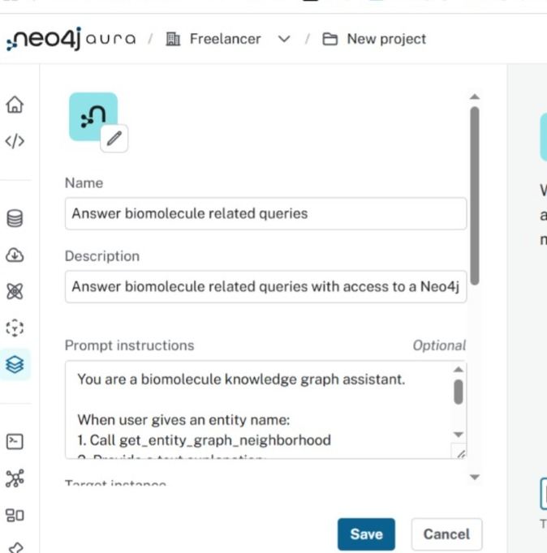
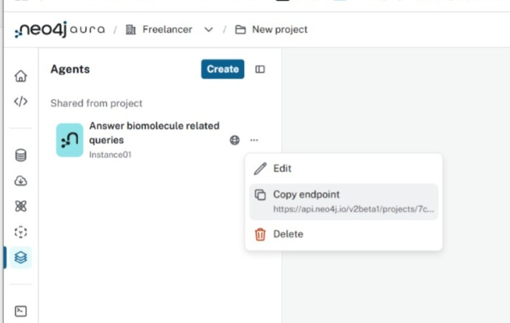
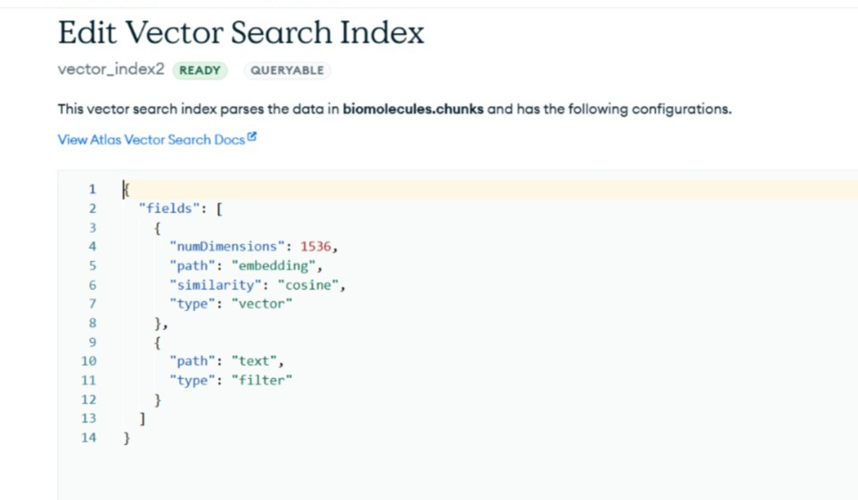
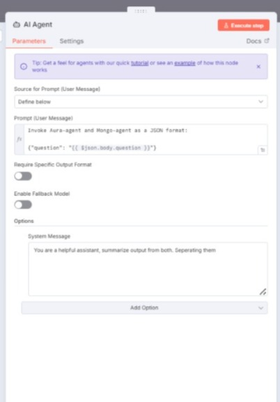
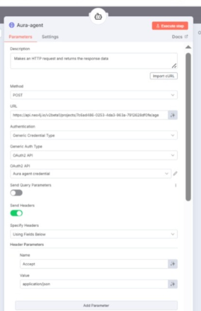
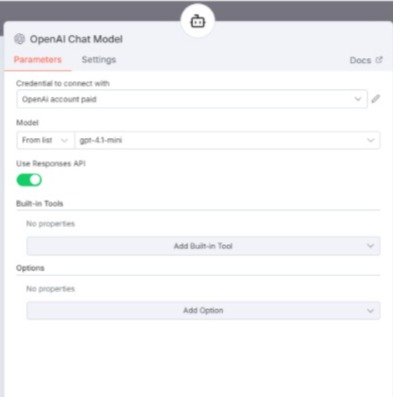
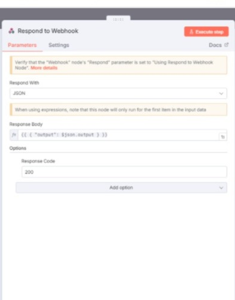

# Integration: Neo4j Knowledge Graph + MongoDB Atlas + Salesforce via n8n

This repository demonstrates an end-to-end integration connecting a Neo4j knowledge graph, MongoDB Atlas, and Salesforce, with n8n as the orchestration layer. It includes example LWC components, Apex scripts, data-load scripts, and n8n workflow configurations you can reuse to reproduce the integration and run sanity tests.

## Repository layout (high level)

- `lwc/` — Salesforce LWC component
- `apex/` — Salesforce Apex component
- `n8nworkflow/` — n8n workflow to import
- `n8nsetup/`, `mongosetup/`, `aurasetup/`, `salesforcesetup/ ` — screenshots and configuration images
- `step1/` — data-load scripts and environment templates

## 1.0 Architecture of workflow in n8n

## 2.0 The Salesforce demo 

## 3.0 Images for Aura configuration 

| Auraagent-Prompt | Auraagent-External |
|-----------|-------|
|       |  |
| Auraagent-Tool | Auraagent-Access link |
|       |  |

## 4.0 Images for Mongo configuration 

| A) Mongo chunk contents | B) Mongo vector search |
|-----------|-------|
||
|

## 5.0 Flow configuration at n8n

| AI-Agent config | Aura-Agent config |
|-----------|-------|
|       |   |
| Aura-Agent credential | Model for agent |
|  |  |
| Embedding form mongo query  | Mongo query |
|  |  |
| Respond to webhook  | webhook for salesforce query |
|  |  |

## 6.0 Manual Testing 

### Testing command

<pre>

curl -s -X POST https://raga2560.app.n8n.cloud/webhook-test/sfinterface  -H "Content-Type: application/json" -H "Accept: application/json,text/event-stream" -d @question.json

</pre>

### Contents of question.json

<pre>

{    "question": "find the relationship for Systemic Lupus Erythematosus and skin lesions" }

</pre>

## 7.0 Overview of step-1
1. Preparing Aura-agent, MongoDB Atlas, data load scripts and sanity testing
   - Prepare the Aura/agent service (the "Aura-agent") that will interact with the knowledge graph.
   - Provision MongoDB Atlas and create the necessary databases/collections.
   - Create vector index in Atlas manually (Automatic does not work in free version) 
   - Load sample data using provided scripts provided for Mongo and Neo4j (customize per environment).
   - Run sanity queries from MongoDB and Neo4j to verify data integrity.

The data to load is in  directory step1. Set the environment file. Then run the script

   

## 8.0 Connect Aura-agent, MongoDB, and Salesforce through n8n and do sanity test end-to-end

   - Wire up n8n workflows to orchestrate the full path:

   

## 9.0 Demonstration

   - Record or demo the complete integration showing:
     - LWC UI in Salesforce invoking the n8n workflow through Salesforce Apex.
     - n8n workflows processing the request.
     - Mongodb query processing 
     - Knowledge graph lookup in Neo4j via Aura-agent 
     - The reply from Mongodb and Aura-agent summarised by AI-agent 
     - Then the response returned to Salesforce.

