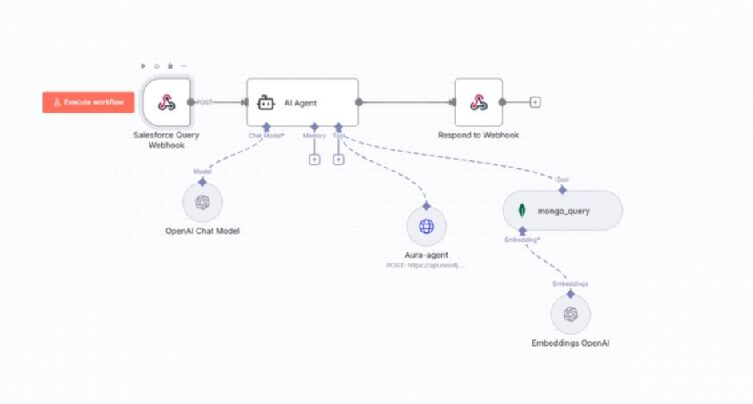
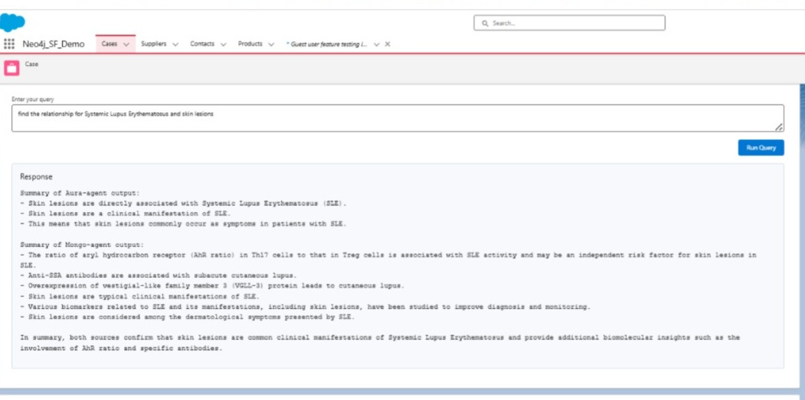
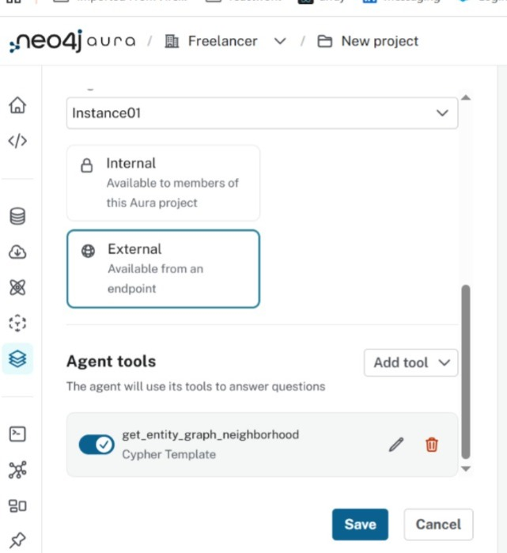
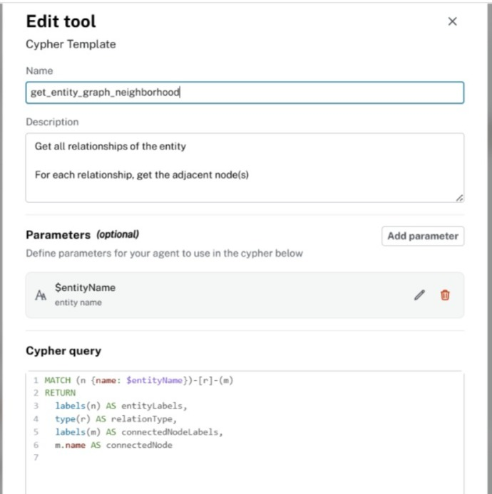
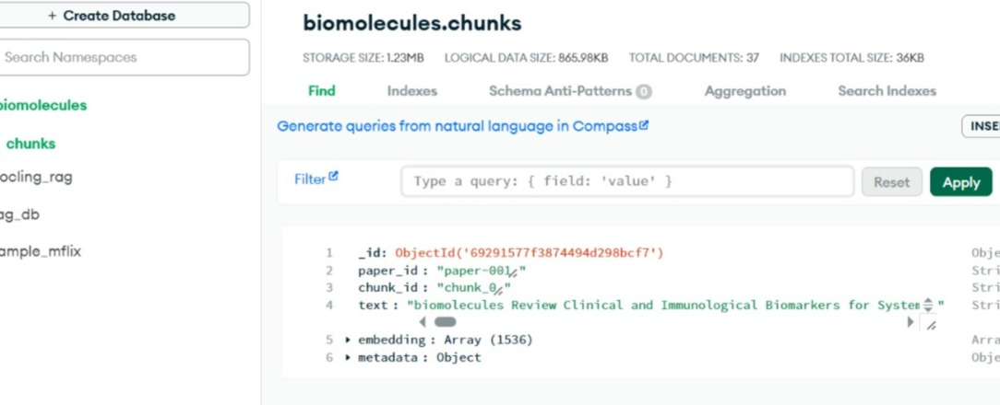
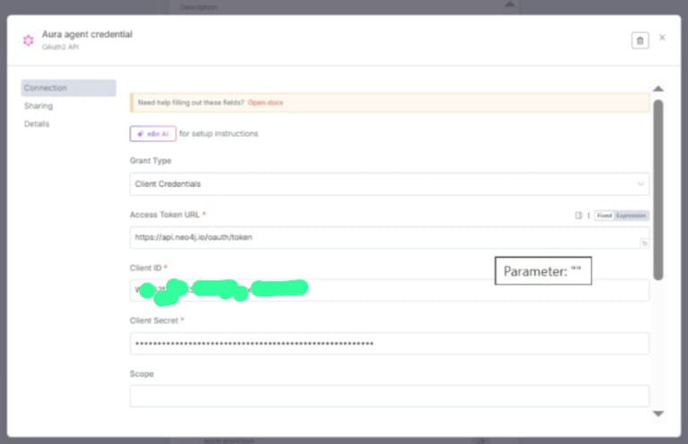
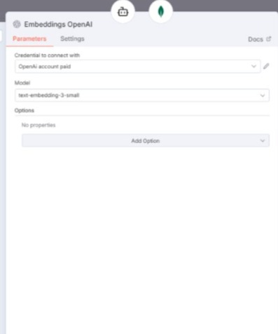
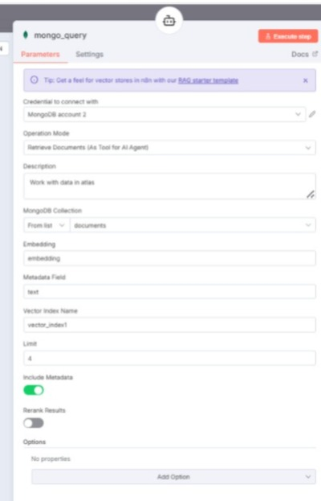
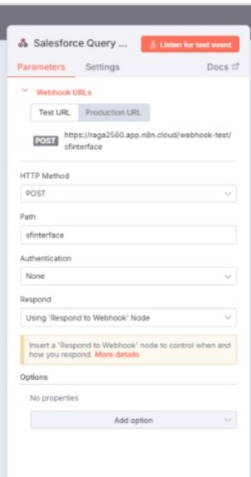

# Integration: Neo4j Knowledge Graph + MongoDB Atlas + Salesforce via n8n

This repository demonstrates an end-to-end integration connecting a Neo4j knowledge graph, MongoDB Atlas, and Salesforce, with n8n as the orchestration layer. It includes example LWC components, Apex scripts, data-load scripts, and n8n workflow configurations you can reuse to reproduce the integration and run sanity tests.

## Repository layout (high level)

- `lwc/` — Salesforce LWC component
- `apex/` — Salesforce Apex component
- `n8nworkflow/` — n8n workflow to import
- `images/` — screenshots and configuration images
- `step1/` — data-load scripts and environment templates

## 1.0 Architecture of workflow in n8n

## 2.0 The Salesforce demo 

### Salesforce image

### Video of demo working 

## 3.0 Images for Aura configuration 

| A) Auraagent-Prompt | B) Auraagent-External |
|-----------|-------|
|       |  |
| C) Auraagent-Tool | D) Auraagent-Access link |
|       |  |

## 4.0 Images for Mongo configuration 

| A) Mongo chunk contents | B) Mongo vector search |
|-----------|-------|
||
|

## 5.0 Flow configuration at n8n

| A) AI-Agent config | B) Tool-Aura-Agent  |
|-----------|-------|
|       |   |
| C) Aura-Agent credential | D) Model for AI-Agent |
|  |  |
| E) Embedding for mongo query  | F) Tool-Mongo query |
|  |  |
| G) Webhook for Salesforce query   |H) Respond to webhook |
|  |  |

## 6.0 Manual Testing 

### Testing command

<pre>

curl -s -X POST https://raga2560.app.n8n.cloud/webhook-test/sfinterface  -H "Content-Type: application/json" -H "Accept: application/json,text/event-stream" -d @question.json

</pre>

### Contents of question.json

<pre>

{    "question": "find the relationship for Systemic Lupus Erythematosus and skin lesions" }

</pre>

## 7.0 Overview 

Preparing Aura-agent, MongoDB Atlas, data load scripts and sanity testing
   - Prepare the Aura/agent service (the "Aura-agent") that will interact with the knowledge graph.
   - Provision MongoDB Atlas and create the necessary databases/collections.
   - Create vector index in Atlas manually (Automatic does not work in free version) 
   - Load sample data using provided scripts provided for Mongo and Neo4j (customize per environment).
   - Run sanity queries from MongoDB and Neo4j to verify data integrity.

The data to load is in  directory `step1/`. The file `biomolecules-11-00928-v2-trunc.pdf` will be chunked and loaded by the script.

Set the environment as in file `env.txt`. 

Then run the script `interactive_pdf_to_neo4j_mongo.py` after setting proper python environment

   

## 8.0 Wiring up

   - Connect Aura-agent, Mongo-agent, AI-Agent and Salesforce through n8n 

   - Make necessary configurations for the nodes
   
   - Orchestrate the full path, do sanity testing

   

Testing command

<pre>

curl -s -X POST https://raga2560.app.n8n.cloud/webhook-test/sfinterface  -H "Content-Type: application/json" -H "Accept: application/json,text/event-stream" -d @question.json

</pre>

Contents of question.json

<pre>

{    "question": "find the relationship for Systemic Lupus Erythematosus and skin lesions" }

</pre>

## 9.0 Demonstration

   - The complete integration showing:
     - LWC UI in Salesforce invoking the n8n workflow through Salesforce Apex.
     - n8n workflows receives the request through webhook.
     - n8n node AI-Agent connects the two tools Mongo-Agent and Aura-agent
     - Mongo-agent doing Mongodb query processing 
     - Aura-agent doing Knowledge graph processing
     - The reply from Mongo-agent and Aura-agent summarised by AI-agent 
     - Then the response returned to Salesforce via Respond to webhook node of n8n.

### Demo of working n8n integration

